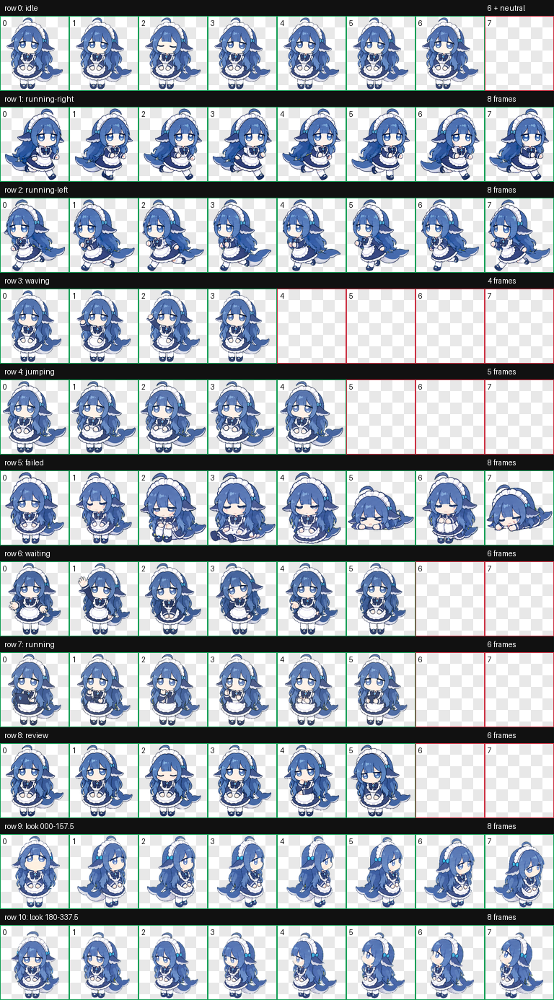

# 小D Codex 桌宠

> 非官方同人项目，与 DeepSeek（深度求索）无隶属、赞助、合作或认可关系。

小D是一只穿着女仆装的鲸鱼娘。这个仓库提供可直接安装的 Codex v2 桌宠包、矢量源文件以及动画预览。



## 特点

- Codex v2 桌宠格式，`spriteVersionNumber: 2`
- 8 × 11 精灵图，尺寸为 1536 × 2288
- 包含待机、左右移动、挥手、互动、失败、等待、处理中和检查等标准状态
- 包含 16 个观察方向
- 保留 SVG 矢量源文件，方便后续高清修改
- 鲸尾保持上蓝下白，人物双手位于腹部下方

## 安装

当前按 macOS 的 Codex 桌宠目录演示。下载或克隆本仓库后，在仓库根目录运行：

```bash
mkdir -p "$HOME/.codex/pets/xiaod"
cp pet/pet.json pet/spritesheet.webp "$HOME/.codex/pets/xiaod/"
```

然后重新打开 Codex，在桌宠列表中选择“小D”。

## 文件说明

```text
pet/
  pet.json              桌宠配置
  spritesheet.webp      可直接安装的 v2 动画图集
source/
  xiaod-master.svg      矢量源文件
preview/
  contact-sheet.png     全部动画状态预览
  look-directions.png   16 个观察方向预览
qa/
  validation.json       精灵图结构验证摘要
```

运行时使用的是 WebP 精灵图；SVG 是高清编辑母版，不会被 Codex 直接加载。

## 素材说明

本项目是基于社区流传的 DeepSeek 鲸鱼娘形象制作的非官方同人桌宠。仓库不包含最初的参考图片，也不使用 DeepSeek 官方 Logo。角色、美术素材和商标的使用边界请参阅 [ASSET_NOTICE.md](ASSET_NOTICE.md)。

## English

Xiao D is an unofficial, fan-made Codex v2 desktop pet inspired by the community DeepSeek whale-girl character. This repository is not affiliated with, sponsored by, or endorsed by DeepSeek. See [ASSET_NOTICE.md](ASSET_NOTICE.md) before redistributing the artwork.
